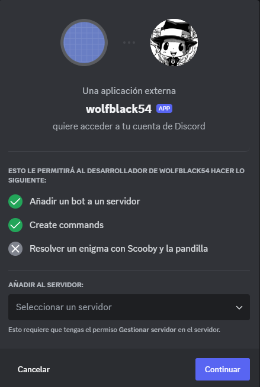

---

Discord AI SelfBot

A simple Discord AI bot that you can talk to in a Discord voice channel and interact with.

## Requirements

- Discord AI Bot (create your own): [https://shapes.inc/](https://shapes.inc/)
- SelfBot Token (tutorial): [https://www.youtube.com/watch?v=6k-ecr4cIa4](https://www.youtube.com/watch?v=6k-ecr4cIa4)

### Invite Your Discord Bot



Copy the bot's ID and put it in the `.env` file.

## Installation

1. Fill in the required information in the `example.env` file and rename it to `.env`:

   ```
   VOICECHANNEL="the voice channel id that the bot will connect to"
   LOGSCHANNEL="the id of the logs channel"
   IACHANNEL="the id of the channel where the AI bot is installed"
   GUILD="the guild id where the bot will join the voice channel"
   TOKEN="the token of the bot"
   LISTENINGUSERID="the id of the user who will talk to the bot"
   AIDISCORDBOTID="the id of the invited AI Discord bot"
   PREFIX="the bot's command prefix"
   ```

2. Compile the TypeScript code:

   ```
   tsc
   ```

3. Run the bot:

   ```
   node dist/index.js
   ```

That's all! You can now talk to the bot when it's connected. If you encounter any problems, feel free to ask for help.

## Commands

With your prefix and the command voice you can change the voice channel of the bot if you want to change the voice channel connection

`<prefix>voice <voice channel id> `

Other command is user when you uses this command and mention the user you change the user that the bot is listening to

`<prefix>user <user mention> `
